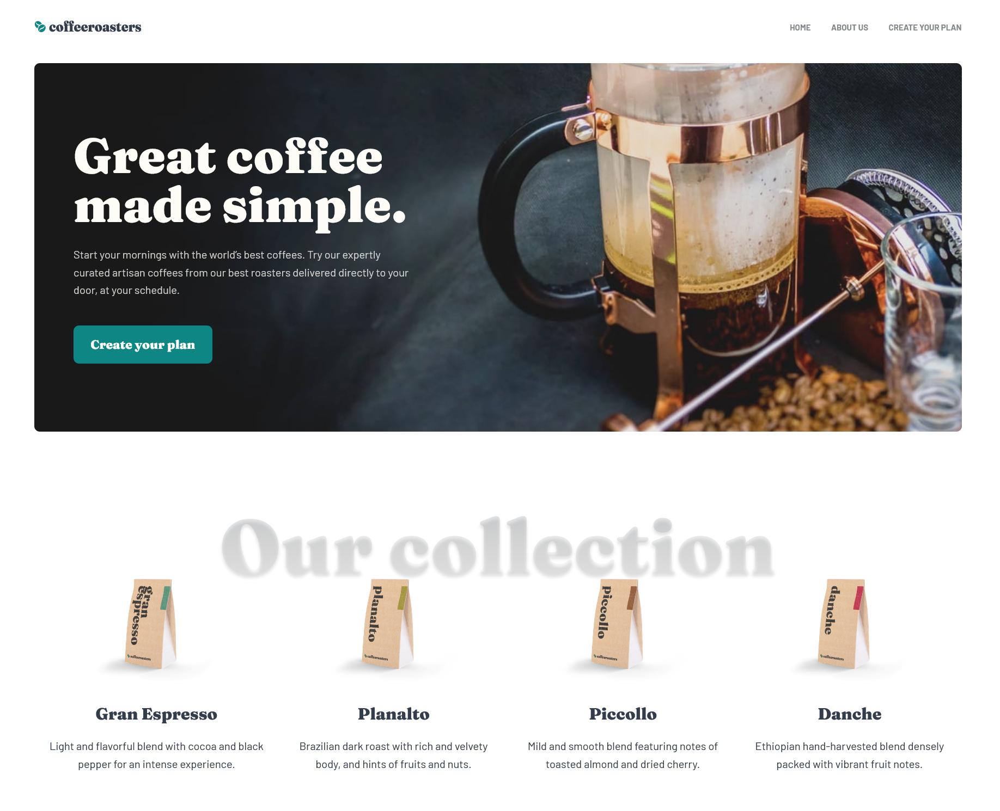

# Frontend Mentor - Coffeeroasters subscription site solution

This is a solution to the [Coffeeroasters subscription site challenge on Frontend Mentor](https://www.frontendmentor.io/challenges/coffeeroasters-subscription-site-5Fc26HVY6).

## Table of contents

- [Overview](#overview)
  - [The challenge](#the-challenge)
  - [Screenshot](#screenshot)
  - [Links](#links)
  - [Built with](#built-with)
  - [Useful resources](#useful-resources)
- [Author](#author)

## Overview

The goal was to create a 3-page coffee subscription website.

### The challenge

Users should be able to:

- View the optimal layout for each page depending on their device's screen size
- See hover states for all interactive elements throughout the site
- Make selections to create a coffee subscription and see an order summary modal of their choices

### Screenshot

### Links

- Solution URL: [GitHub](https://github.com/mbensa/coffeeroasters)
- Live Site URL: [CoffeeRoasters](https://coffeeroasters.mbensa.com/)

### Built with

- Semantic HTML5 markup
- CSS custom properties
- Flexbox
- Mobile-first workflow
- Sass
- JavaScript

### Useful resources

- [Css Tricks](https://css-tricks.com/) - This website is full of useful CSS tricks. I really love the CSS Flexbox guide.

## Author

- Website - [Mojca Bensa](https://www.mbensa.com)
- Frontend Mentor - [@mbensa](https://www.frontendmentor.io/profile/mbensa)
